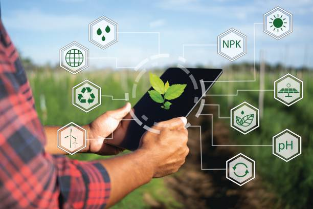

# Decentralized IoT Solution for Smart Agriculture Using Edge Computing

---

> **Empowering farmers with decentralized, real-time, and privacy-focused irrigation management.**

## 🌱 Project Overview

This project delivers an intelligent, **decentralized smart agriculture platform** leveraging edge computing to optimize irrigation. Designed for sustainability, autonomy, and privacy, our system eliminates dependency on external cloud services, giving **full control to farmers** over their data and irrigation operations. It utilizes **ESP32-based sensor nodes** and a **Raspberry Pi master controller** with a modern local+web dashboard.

## 🎯 Key Features

- **Autonomous Irrigation**: Automated sprinkler activation based on real-time soil moisture readings.
- **Edge-Driven Privacy**: All data is processed and stored locally—no third-party cloud required!
- **Web-Based Monitoring**: Instantly access live data and irrigation status via a responsive dashboard (Flask + Ngrok).
- **Modular & Scalable**: Easily add more ESP32 sensor nodes to expand across larger fields.
- **Low-Cost Hardware**: Uses affordable components for accessibility and ease of replacement.
- **Open-Source & Extensible**: Designed for community contributions and integration of new sensors/functions.

## 🏗️ System Architecture

- **Hardware**: Raspberry Pi, multiple ESP32 microcontrollers, soil moisture sensors, relay-based sprinkler system.
- **Software**: 
    - ESP32 firmware (Arduino/C)
    - Python scripts for Raspberry Pi (data collection, dashboard, irrigation control)
    - Flask for web server
    - Ngrok for secure remote access
- **Communication**: ESP32 nodes connect via WiFi, sending JSON-encoded sensor data to the Pi.
- **Dashboard**: See soil moisture levels, sprinkler status, and logs on an intuitive web interface (green-themed for agriculture!).

## 🚀 Quickstart Guide

### Prerequisites
- Raspberry Pi (3/4 recommended)
- ESP32 microcontrollers
- Soil moisture sensors
- Relay modules/sprinklers
- Python 3.x installed (on Pi)
- Ngrok account (free)

### Setup Steps
1. **Clone the repository**:
    ```bash
    git clone https://github.com/kishore-144/IoT_Decentralized.git
    cd IoT_Decentralized/CODES
    ```
2. **Flash ESP32 Firmware**:
    - Use Arduino IDE to upload the provided firmware to each ESP32, connecting soil moisture sensor and relay as specified.
3. **Boot Raspberry Pi & Install Dependencies**:
    ```bash
    pip install flask requests
    ```
4. **Configure WiFi connections**:
    - Connect ESP32 nodes and Raspberry Pi to local WiFi network.
5. **Start the Dashboard Server**:
    ```bash
    python wifi.py
    python app.py
    ```
6. **Expose Local Server with Ngrok** (optional for remote access):
    ```bash
    ngrok http 5050
    ```
7. **Open Dashboard**:
    - Access via http://localhost:5050 or your Ngrok public URL.
8. **Monitor & Control**:
    - Sprinklers activate automatically per soil moisture readings. Manual controls available in dashboard.

## 🛡 Security & Data Ownership
- **All sensor data remains local to your farm setup**.
- Remote access is encrypted with Ngrok; no data sent to third-party cloud storage.
- Easily extendable for further security (authentication, blockchain logging, etc).

## 🌟 Future Enhancements
- Add more sensors (temperature, humidity, leaf health)
- Enable solar power for nodes for full field autonomy
- Integrate weather forecast APIs for even smarter irrigation
- Expand dashboard to mobile platforms

## 🎓 Reference & Inspiration
Based on the real-world smart irrigation model:
> Morchid, Qjidaa, Jebabra, Khalid, Jamil, El Alami. "IoT-based smart irrigation management system to enhance agricultural water security using embedded systems, telemetry data, and cloud computing." *Results in Engineering* (2024).

---

<p align="center">
  
</p>

> **Ready to make your farm smart, resilient, and truly yours? Fork & contribute!**

---

<details>
  <summary><b>Contact & Support</b></summary>
  📧 Email: kishoreb2253@gmail.com<br>
  🏫 SASTRA Deemed University, Computer Science 2025
</details>

---

#### 

> *For more, see `/Final VIVA/Project-Report.docx` and `/Final VIVA/Final-VIVA-PPT.pptx` in this repo!*
